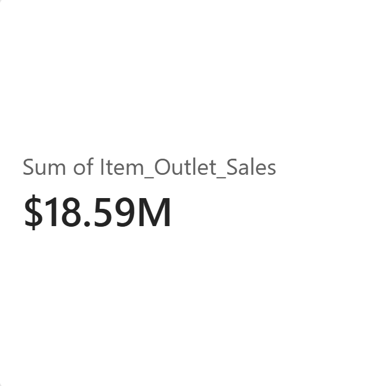
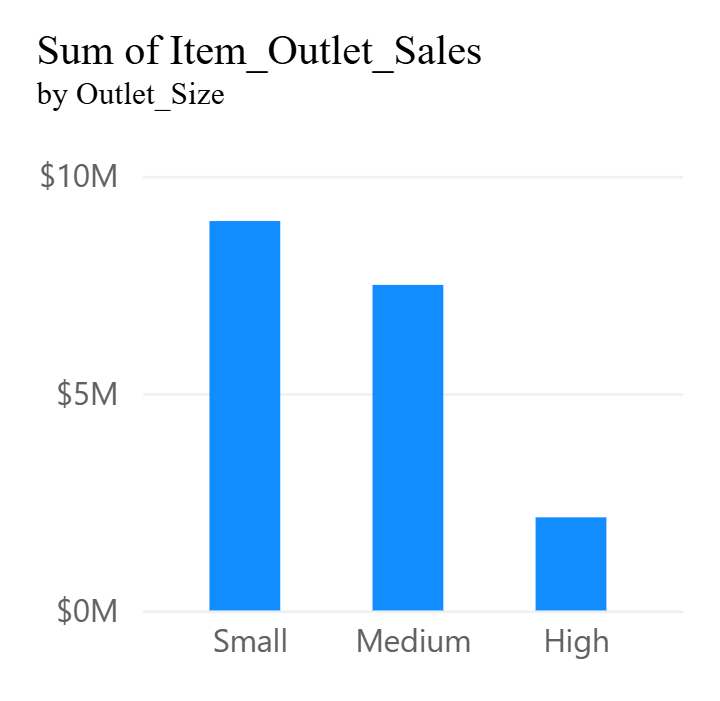
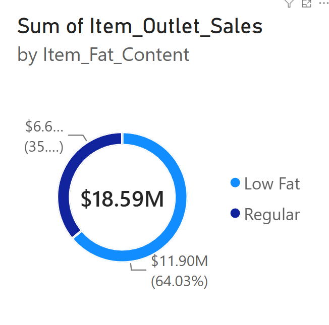
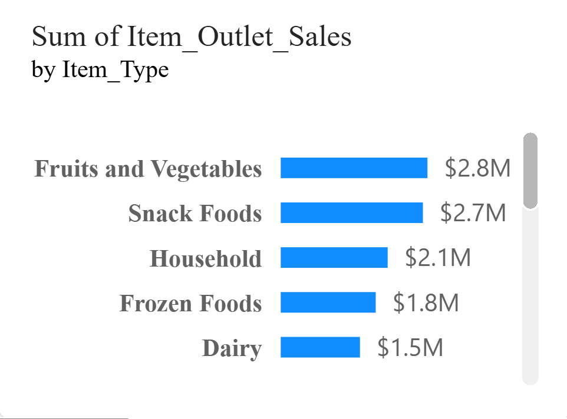

# Blinkit Grocery Sales Analysis (SQL)

## Project Overview
This project conducts an end-to-end exploratory analysis of Blinkit's grocery sales dataset using SQL. The goal is to analyze revenue drivers, product category performance, store size profitability, and customer purchasing preferences across location tiers.

## Skills Demonstrated
* **Database Cleaning:** Data standardization (`UPDATE`, `WHERE`, `IN`)
* **KPI Calculation:** High-level metrics aggregation (`SUM`, `AVG`, `COUNT`, `ROUND`)
* **Business Analysis:** Data slicing and segmentation (`GROUP BY`, `ORDER BY`, `HAVING`)
* **Conditional Logic:** Price tier classification (`CASE WHEN`)

## Key Business Metrics (KPIs)
* **Total Revenue:** $18591125.41
* **Average Sales Per Item:** $2181.29
* **Total Items Sold:** 8523

## Key Insights & Findings
1. **Fat Content Preference:** Low Fat items generated (**$11904094.53**) across (**5517**) items, outperforming Regular fat items. Where Regular Fat Content sales is (**$6687030.88**) across (**3006**) items.
2. **Top Selling Category:** [Fruits and Vegetables] is the highest revenue-generating category (**$2820059.82**).
3. **Outlet Size Impact:** [Medium] stores produced the highest overall sales volume which is (**7489718.69**).
4. **City Tier Performance:** [Tier 3] locations generated the most revenue Order by Tier 2 and 1.

## Dashboard
**1. Key Performance Indicators (KPIs)**
Total Sales ($18.59M): Cumulative revenue generated across all store outlets and grocery inventory.

Average Sales ($2.18K): Mean revenue generated per item entry across all outlet locations.

Insight: Strong cumulative revenue paired with high average sales per item indicates solid item throughput across the retail network.

**2. Sales by Outlet Size**

Small Outlets: Lead total revenue generation, contributing approximately $9M.

Medium Outlets: Represent the second-largest share at around $7.5M.

High (Large) Outlets: Account for the smallest revenue share at roughly $2.5M.

Insight: Compact store footprints drive over 80% of total sales volume, highlighting high sales efficiency and broader geographic reach for smaller retail formats.

**3. Sales by Fat Content**

Low Fat Inventory: Dominates customer demand, generating $11.90M (64.03%) of total sales.

Regular Inventory: Contributes $6.69M (35.97%) of overall revenue.

Insight: Consumer purchasing heavily favors healthier, low-fat grocery items, signaling a key strategic opportunity to prioritize low-fat inventory stocking.

**4. Top Product Categories (Sales by Item Type)**

Fruits & Vegetables: Top revenue driver at $2.8M.

Snack Foods: Second-highest category contributing $2.7M.

Household Essentials: Generates $2.1M, followed by Frozen Foods ($1.8M) and Dairy ($1.5M).

Insight: Fresh produce and convenience snacks generate the main bulk of sales, serving as primary traffic anchors for store locations.

## Repository Structure

├── README.md
├── blinkit-grocery-analysis.sql
├── Contain_Raw_Data.csv
└── Dashboard/
    ├── Blinkit_Grocery_Sales.pbix
    ├── Total_sales.png
    ├── sales_by_Outlet_size_.png
    ├──sales_by_fat_content
    └── Sales_by_item_type
    

## Author

**Muntasir Matin Siyam**  
BSc (Hons) Computing Systems  
Ulster University London
